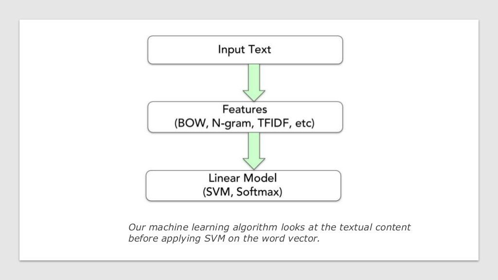
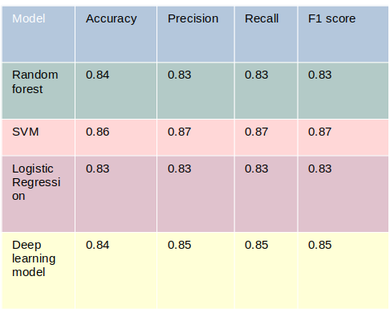

# Binary classification for detecting job location from it's description
 

In this project we are using SVM binary classification for selecting a job location from it's description. Whether a job is restricted to United states only or not.

An end-to-end text classification pipeline is composed of three main components:
 

## Dataset Preparation ( Cleaning and Analysis ) 
 

The first step is the dataset preparation, in our case we are going to work with the job description as input and the column us-only as labels. After that, we perform basic text pre-processing to the inputs, we notice here that our job description is an html code of the webpage of the job. So, we need to fix that, we need a cleaning function in order to extract clean text from it.

Finally, we split our dataset into train, validation and test sets  : 
  - Training Dataset, the sample of data used to fit the model.Its the actual dataset that we use to train the model (weights and biases in the case of a Neural Network). The model sees and learns from this data.
 
  - Validation Dataset, the sample of data used to provide an unbiased evaluation of a model fit on the training dataset while tuning model hyperparameters. The evaluation becomes more biased as skill on the validation dataset is incorporated into the model configuration.
    
   - Test Dataset, the sample of data used to provide an unbiased evaluation of a final model fit on the training dataset.

 

## Feature Engineering ( Transform text to number ) 

 

Feature engineering is one of the most important steps in machine learning. It is the process of using domain knowledge of the data to create features that make machine learning algorithms work. Focusing first on our data will give us better results than focusing only on models. Feature engineering helps us to create better data which helps the model understand it well and provide reasonable results.

In this step, raw text data will be transformed into feature vectors and new features will be created using the existing dataset. We will try to implement  different ideas in order to obtain relevant features from our dataset. Here are some feature extraction techniques for NLP:

   - Bag of Words : The bag-of-words model is a simplifying representation used in NLP. In this model, a text is represented as the bag of its words, disregarding grammar and even word order but keeping multiplicity.
    

    
    

   - TF-IDF : is short for term frequency–inverse document frequency. It’s designed to reflect how important a word is to a document in a collection or corpus. The TF-IDF value increases proportionally to the number of times a word appears in the document and is offset by the number of documents in the corpus that contain the word, which helps to adjust for the fact that some words appear more frequently in general.
 
     

      
     

    
   - Word2vec : is a group of related models that are used to produce word embeddings. It takes as its input a large corpus of text and produces a vector space, typically of several hundred dimensions, with each unique word in the corpus being assigned a corresponding vector in the space. Word vectors are positioned in the vector space such that words that share common contexts in the corpus are located in close proximity to one another in the space.
   
   

    
   

    
 

 
## Model Training 
 

The final step in the text classification framework is to train a classifier using the features created in the previous step. There are many different choices of machine learning models which can be used to train a final model. We will implemented  different classifiers for this purpose:

- Naive Bayes Classifier
- Random Forest 
- Support Vector Machine 
- Logistic Regression
- deep learning (Neural Networks)
    
  We got the following results : 
  
  

  
  
  Since SVM gave us the best results we used this model for our prediction.
  
# How the code works 

  We have 3 main folders and two txt files that contains the requirement (the models needed) to execute the code. In our Data folder without any surpises we find the data needed to train our model. In the folder Models  we find all the trained models that we wanted to save. The Data folder isn't available for confidential reasons. 
  

In the folder app we find three function : 
- cleaning : take as input the main dataset and specification about what column we want to use as input data and what column to use as labels and returns input data cleaned with their labels. 
- algo: take as input the input data and then trains the model before saving it in Models.
-  main: in main we can make our predictions with a models of our choosing.

The code is flexible gives possibility to do ani text classification we wanted just by changing the input variables. 

If we want to train a new model, 
- We gather Data put them in the Data folder.
- Clean the Dataset using cleaning if needed.
- Train the model with the function algo : We modify our code to use the model wanted, here we gave an example for SVM but many other Models are available in scikit-learn library, we can train multiple models to compare them and use the best one. The trained models are going to be saved in Models automatically. 
- Make predictions using main function : Here we can use our trained model to make new predictions. 
 
If we want to use the model available,
- We give as input the data that we want to predict, the data must be text, a job description. We pass the data to the predict function inside the main, and we get the results.  

